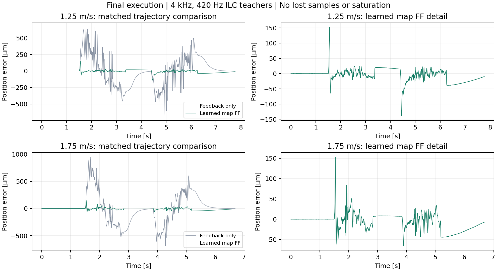

# 加速度FFの精度改善（2026-09-08）

## 目的と維持する条件

`acceleration_ff_experiment.m` の教師取得・同定・未学習軌道の比較を、精度を下げずに完了する。
2026-09-09 05:20 JSTに実験本体の全体実行が正常終了した。6教師は帯域変更前の420 Hz ILCを
基準に精度・反復安定性・非飽和を通過し、マップは未学習2軌道でFB単独からの誤差改善を実測した。
ユーザーから未学習軌道の絶対精度の指定値はなく、そこで教師と同じ数µmを達成したとは扱わない。
終了コード0だけでなく、以下の実測結果と停止状態を完了の根拠にする。

| 未学習最高速度 | FB単独RMS | マップFF RMS | マップ最大誤差 | 最大総電流 |
| --- | --- | --- | --- | --- |
| 1.25 m/s | 199.507 µm | 21.282 µm | 152.1 µm | 1.9853 A |
| 1.75 m/s | 254.508 µm | 21.214 µm | 153.0 µm | 1.9405 A |

本体の4比較は欠落・飽和0。高速移動中44,328区間で位置ホールド0、送信FFとログの差0。
これは制御周期ごとの全PDO更新を保証する診断ではない。
全4軸無励磁・トルク指令0、速度0、実Target active/servo 0、fault 0を終了後にADSで確認した。

最終記録:

- `data/acceleration_ff/20260908_accuracy_completion/main_execution/execution_result.mat`
- `data/acceleration_ff/20260908_accuracy_completion/main_execution/comparison.csv`
- `data/acceleration_ff/20260908_accuracy_completion/main_execution/final_audit.json`
- `data/acceleration_ff/20260908_accuracy_completion/main_execution/post_exit_state.json`
- 教師一覧: `data/acceleration_ff/current_teachers.mat`
- マップ: `data/acceleration_ff/20260909_051834_300_map/acceleration_map.mat`

- 移動距離1.25 m、開始54,100,000 count、終点66,600,000 count、可動域上限66,655,810 count。
- 教師の最高速度1.0・1.5・2.0 m/s、未学習軌道1.25・1.75 m/s、4 kHz、既存FB。
- Qの帯域420 Hz、実機の総電流上限2 A。途中の飽和でもILCを継続する。
- 最終試行の飽和・未収束・欠落を不合格にする既存判定、前後の無励磁確認、独立ADS監視。
- マップの教師はILCの適用FF（row7）。解析用の総電流row3を教師に置き換えない。

## 未学習軌道の端部誤差

従来のマップは両端2 cmを使わず、係数が全0の通常FFへ接続していた。
40 Hz教師から作った旧マップの1.75 m/s試行では、中央5.6～6.4 mの移動中RMSは66.7 µmだが、
両端付近は346～437 µmだった。開始・反転時の補償不足が大きな誤差の原因の一つ。

同じ保存済み40 Hz教師を使い、マップ側だけを変えた診断を実施した。
これは40 Hz教師の精度要件を再承認するものではない。

| 設定 | 速度 [m/s] | 全区間RMS [µm] | 最大誤差 [µm] | 飽和 | 採用判定 |
| --- | --- | --- | --- | --- | --- |
| 旧マップ（5 mm刻み・両端2 cm） | 1.25 | 137.55 | 605.8 | 0 | 精度要件の完了判断は撤回済み |
| 旧マップ | 1.75 | 167.89 | 910.5 | 0 | 同上 |
| 0.5 mm刻み・両端0.5 mm | 1.75 | 56.5 | 575.6 | 0 | 診断のみ、バッチ終了0 |
| 上記＋境界係数による端部の通常FF | 1.25 | 26.33 | 294.1 | 0 | 診断のみ |
| 上記＋境界係数による端部の通常FF | 1.75 | 21.15 | 130.8 | 1 | 不合格、バッチ終了1 |

端部の通常FFはまだ未採用。1.25 m/sでは動き出しの誤差294.1 µmが残り、
1.75 m/sでは1点の飽和があった。成功した診断と失敗した診断を混同しない。
各診断後の停止・無励磁を確認済み。

保存先:

- `data/acceleration_ff/20260908_accuracy_completion/endpoint_map_diagnostic/`
- `data/acceleration_ff/20260908_accuracy_completion/endpoint_baseline_diagnostic/`

## 総電流を制約したILC更新

飽和分を事後に除く補正では、420 Hzのprofile 6を15試行まで継続できたが、
最終RMS 9.81 µm・最大113.0 µm・飽和114点で不合格だった。
次に名目モデルの差分式を使い、総電流を予測して制限する更新を検証した。
`quadprog` は稀疎な二次計画を解く既存MATLAB機能を使用する。
[MathWorksの公式説明](https://www.mathworks.com/help/optim/ug/large-sparse-quadratic-program-with-interior-point-algorithm.html)

最初の制約付き更新は、誤差だけをQで処理し、蓄積したFFへのQを省いていた。
25試行で未収束・最終飽和156点。FFの反復差の約83～90%が420 Hz超に集中しており、
その後も学習し続ける形は適切ではなかった。
総電流の2階差分も抑える試行では、移動中RMSが一時5.23 µmまで下がったが、
25試行目は15.31 µm・飽和61点となり不合格。いずれも教師へ採用していない。

現在の `src/update_ilc_constrained.m` は、元の
`Q²{f + alpha*(C + Gn⁻¹)*e}` を候補として維持する。
候補が予測総電流の制約を満たす場合は変更しない。超えるときだけ、候補からの
位置・電流の変化を小さく保つ制約付き補正を解く。補正の2階差分も抑える。
予測誤差からFBを計算して引き、Reference/Delay1の1サンプル分を戻して送信FFにする。
当初は実機上限2 Aに対して10 mAを予測誤差用に残したが、実測では不足した。
FF単独の2 A未満条件は課さない。
元のexp04の通常ILC経路には、この切替を適用しない。

最大反復数を15から25へ増やした。成功判定を緩める変更ではない。
数値テストでは総電流上限、閉ループでの予測再現、高周波リプルの抑制、
実行可能な候補が元の学習則と完全に一致することを確認した。
有限波形のFFTには窓を掛け、両端の不連続をリプルと誤認しない。

保存先:

- `constrained_ilc_profile6/`: 最初の制約付き更新、25試行で不合格。
- `constrained_ilc_smooth_current/`: 総電流の高周波変動を抑制、25試行で不合格。
- `projected_q_ilc/`: 元のQを保持する更新のオフライン検証。実機運転なし。
- `projected_q_ilc_run/`: 元のQを保持する更新。25試行、全区間RMS 9.3807 µm・最大78.4 µm・最終飽和90点で不合格。欠落0、終了コード1、全4軸無励磁を確認済み。
- `prediction_margin_audit/`: 記録した予測電流と次試行の実測電流を照合。オフライン解析は終了コード0。
- `robust_current_ilc/`: 総電流の予測制約を±1.85 Aに変更。2回目のみ71点の飽和、3～25回目は飽和0。最終全区間RMS 8.6801 µm・最大78.3 µm、欠落0。誤差・FFの収束条件は未達で終了コード1、教師未採用。全4軸無励磁・指令0を確認済み。
- `fixed_ff_repeatability/`: 最後のFFと、最後の8試行のFF平均を交互に3回ずつ固定して計測。全6回で飽和・欠落0、終了コード0、全4軸無励磁。教師採用ではない。
- `relaxed_ilc_collection/`: 更新を1/4に緩和したprofile 6は25回で未収束、終了コード1。残る5教師は実行していない。全4軸無励磁・指令0を確認済み。後述の精度比較により緩和は不採用、ソースから撤回。

上記の相対パスの基点は `data/acceleration_ff/20260908_accuracy_completion/`。
オフライン候補の800 Hz超の電流振幅比だけでは、位置精度への影響を表せなかった。
現候補の同帯域による予測位置RMSは0.00286 µmで、0.1 µm/countより小さい。
これはモデル上の確認であり、実測の精度・飽和判定の代用にはしない。

予測と実測を照合すると、後半の試行でも上限付近で実測電流が予測より最大0.14 A高くなった。
`row7 + C*e` を±2 Aで制限するとrow3を約6e-11 A以内で再現でき、電流ログの時刻違いが原因ではない。
予測誤差を0.15 A見込む場合の候補は、最後の実測RMS 9.3807 µmに対して予測RMS 6.3677 µm・最大57.1 µm。
10 mAの場合の予測RMS 6.1673 µmとの差だけで採用を決めず、実機で精度が保たれることを確認する。
帯域420 Hz、距離1.25 m、最高速度2.0 m/s、実機上限2 Aは変更していない。
150 mAの実機検証は最終全区間RMS 8.6801 µm・最大78.3 µmで、変更前の420 Hz試行
（同じprofile 6、全区間RMS 11.3011 µm・最大112.0 µm）より小さかった。
ただし、直近の誤差相対変化32.14%・FF変化7.75%で未収束。精度維持の1試行の根拠と、教師取得完了を区別する。

制御軸の切替境界付近に試行変動が集中するかも調べた。境界±2 mmは移動中サンプルの1.25%、
誤差変動エネルギーの2.65%であり、支配的な原因ではなかった。PLCの切替処理は変更しない。

## 学習更新による変動の切り分け

最後のFFを固定した3回は全区間RMS 8.9～11.1 µm、最大誤差69.4～121.5 µm。
最後の8試行のFFを平均した波形の3回はRMS 6.3～7.4 µm、最大57.8～63.3 µm。
平均化で帯域は変更しておらず、平均したFFも実機へ適用して測定した。3回だけで精度達成とは判定しない。

この結果に基づき、8回目以降の候補を `f + 0.25*(Q候補-f)` としてから総電流制約を適用する実験を行った。
Qの420 Hzや元の更新が0になる点は維持し、後半の各試行の変動を学習し過ぎないようにする。
数値テストで、初期の候補が元の学習則と一致し、後半の候補が上式と一致することを確認した。
収束・最終飽和・精度の実機判定は未変更。

緩和した系列の最終試行は全区間RMS 8.3334 µm・最大74.8 µm・飽和0だったが、誤差相対変化14.61%で未収束。
最後の1回だけでなく、10～25回目を同じ範囲で比較した。移動中RMSの平均は10.2569から9.6634 µmへ減ったが、
停止中を含む全区間のRMSは8.0858から8.7385 µmへ増加した。全区間の精度が改善した根拠がないため、
**更新緩和は不採用としてソースを元に戻した**。使用した実装は同ディレクトリの `implementation_used.txt` に保存。
現行は420 Hz・予測電流±1.85 Aの制約付き更新。緩和前の対象テスト通過時と同じ実装へ戻したため、同一テストの再実行はしない。

現時点では、安定した6教師の取得・精度を保ったマップ同定・未学習軌道の最終比較が未完了。
平均FFの固定反復を教師取得に組み込む実装を追加し、実機で検証している。
精度低下を伴う設定変更や、成功判定を緩める変更では完了させない。

## 固定した平均FFの検証を教師取得へ組み込む

- 最初の16試行以上はILCを行い、直近3更新のFF変化5%以内・直近8試行の飽和0・残留FB/FF 20%以内で検証へ移る。
- 直近8本の適用済みFFの平均を、次試行から同じ波形のまま最低8回実測する。
- 誤差RMS変化5%以内などの従来の最終条件を維持する。固定中に波形が変わった場合は拒否し、飽和した場合はILCへ戻る。
- 最大回数は学習と検証を合わせて40回。教師候補の波形を未適用のまま採用しない。
- `testTeacherRequiresMeasuredFixedFFValidation` と従来の計測拒否テストが通過。固定検証の不足・飽和・誤差変化・波形変更を拒否することを確認した。
- 実機保存先: `fixed_validation_collection/`。最も速いprofile 6から開始し、収束した場合だけ残る5教師へ進む。

profile 6は28回目に収束。全区間RMS 8.0749 µm・最大50.8 µm・電流ピーク1.884 A。
17～28回目の固定検証12回は、全区間RMS 8.0749～10.0611 µm、全検証の最大誤差66.5 µm。
いずれも帯域変更前の同じ軌道（RMS 11.3011 µm・最大112 µm）より小さかった。
全固定検証で飽和0、全28試行で欠落0、固定中のFF差分0、誤差相対変化2.016%。
`fixed_validation_collection/profile_06_audit.json` に再計算結果を保存した。
残る5軌道の取得・同定・未学習軌道比較は引き続き未完了。

元の420 Hzでの6軌道の精度比較基準を `original_420_accuracy_reference.json` に整理した。
profile 2以外は当時の最終試行に飽和があるため、精度の比較用であり教師採用には使わない。

低速profile 1の5～16回目では、±1.85 A予測付近での実電流の外向き予測誤差は最大0.0251 Aだった。
同系列の全該当試行は無飽和なので、row3の電流をそのまま予測と比較できる。
保存先は `profile_01_margin_audit.json`。最速profile 6の最大0.14 Aと異なり、
共通の0.15 Aの予測余裕が低速の精度を制限する可能性がある。
次の候補は、直近の実測と前回予測との差から余裕を推定するもの。固定FFの検証中は学習を行わず、
稼働中のコードは変更しない。予測余裕を変えても実機上限2 A・420 Hz・最終飽和判定は維持する。

profile 1は25回目で収束ゲートを通ったが、最終RMS 6.2800 µm・最大29.8 µmに対し、
基準は5.5710 µm・29.5 µmだった。固定検証9回のRMSは合算で6.5955 µm、最大33.9 µm。
したがって、`passed=true`だけで最終教師に採用せず、精度上は保留とする。
各系列のゲート通過と精度基準を区別した結果を `fixed_validation_collection/precision_audit.json` に保存する。

profile 2は30回目で収束し、最終全区間RMS 4.7978 µm・移動中5.5148 µm・最大27.0 µm。
固定検証14回の全区間RMSは合算4.7265 µm、最大33.3 µmで、元の420 Hz基準を満たした。
profile 3と4も収束ゲートを通ったが、精度基準を満たさないため保留。

固定FFのデータだけで開始位置と試行順序を回帰した。開始位置だけのモデルは全対象で交差検証R²が負、
試行順序を加えたモデルでも説明できる変動は約12～33%だった。
Homing変更や温度原因の断定は行わない。`fixed_waveform_variation_audit.json` に保存した。

軌道別の予測誤差調査は `profile_prediction_errors.json`。現データからの次の検証候補は、
profile 1の予測余裕0.04 A、profile 3・4は0.07 A。いずれも測定した外向き誤差の最大値に10 mA以上を加えた値。
既に精度を満たすprofile 2・6は再取得せず、元データを維持する方針。
予測余裕の変更と合わせ、従来420 Hzの全区間RMS・移動中RMS・最大誤差を実行時の教師採用条件にも追加する予定。

profile 5は個々のFF変化が5～8%程度あり、現行の固定検証開始条件を満たしにくい。
次の候補は、これから実際に検証する8本平均のFFの変化で検証開始を判断するもの。
これは学習から固定検証への切替判断であり、最低8回の実測、誤差変化5%以内、固定波形の同一性、
飽和0、精度比較という最終採用条件を省略するものではない。稼働中の実装は変更していない。

## 固定検証付き6軌道取得の終了結果

`fixed_validation_collection/` は終了コード1。profile 5が40回で未収束のため、同定・比較には進んでいない。
実機試行はprofile 1～6の順に25・30・39・32・40・28回、計194回。全試行で欠落0。
末尾の実機確認は位置54,100,779 count、速度0、全4軸の指令0・無励磁、Fault 0、I/O正常、
実際のTargetの `p_active=p_servo=0`。独立監視は異常なしで終了し、監視プロセスも終了した。

| profile | 全区間RMS [µm] | 移動中RMS [µm] | 最大 [µm] | 収束 | 従来精度以上 |
| --- | ---: | ---: | ---: | --- | --- |
| 1 | 6.2800 | 7.4348 | 29.8 | Yes | No |
| 2 | 4.7978 | 5.5148 | 27.0 | Yes | Yes |
| 3 | 7.8072 | 10.4834 | 42.0 | Yes | No |
| 4 | 7.2396 | 7.1157 | 53.2 | Yes | No |
| 5 | 8.1178 | 10.5310 | 69.7 | No | 最終1回の数値は小さいが教師未採用 |
| 6 | 8.0749 | 10.9310 | 50.8 | Yes | Yes |

全6軌道の最終試行の飽和は0。初期の飽和は履歴に保持している。
profile 1・3・4は精度上の保留、5は固定検証に移らず未収束。2・6の合格記録は再取得せず保持する。
次の実装・検証では、軌道別の電流予測余裕（1: 0.04 A、3/4: 0.07 A）と、
検証対象である8本平均FFの変化に基づく検証開始判断を扱う。
精度採用条件を実行時にも明確にし、残る4教師・同定・未学習軌道比較・正常終了を引き続き完了させる。

## 学習モデルと開始位置の確認

使用中の4 kHz実測周波数応答と名目モデルを照合した。
`Jn=0.0626780333`、`Dn=3.94560059`、遅れ8サンプル。
元の420 Hz Qと学習率0.3の収束指標 `|Q²(1-alpha*J/Jn)|` の最大値は0.7749、
学習率0.9では0.3686だった。この実測応答では1未満であり、遅れを短くする根拠はない。
位置ごとの非線形性や飽和を含む収束を保証するものではない。

開始位置のずれに合わせて過去のFFを位置方向にずらすオフライン解析も行ったが、
反復差は概ね変わらず、Homing直後に悪化する例もあった。FFの位置補正やHomingの変更は採用していない。

- [学習モデルの指標](../data/acceleration_ff/20260908_accuracy_completion/learning_model_margin.json)
- [開始位置補正の診断](../data/acceleration_ff/20260908_accuracy_completion/origin_alignment_audit.json)

## 軌道別の予測余裕と精度採用条件

profile 1の予測余裕を0.04 A、3・4を0.07 Aに設定し、他は0.15 Aを維持した。
実機の総電流上限2 A、420 Hz、軌道・FB・周期・固定バッファは変更していない。
固定検証への移行は実際に検証する8本平均FFの変化で判断する。
最終採用には、従来の収束条件と8回以上の固定実測に加え、従来420 Hzの
全区間RMS・移動中RMS・最大誤差以下を要求する。RMSは直近8回の合算値と最終試行の両方を確認する。
保存済み教師を読み込む同定節でも、同じ精度判定と帯域・周期の照合を行う。

MATLAB R2025aで変更箇所の4テストが通過した。
`testTeacherRequiresMeasuredFixedFFValidation`、`testTeacherConvergenceAndCaptureRejection`、
`testTeacherMarginUsesConfiguredCurrentBound`、`testConstrainedUpdateMatchesClosedLoopPrediction`。
平均FFの検証不足、変化、飽和、精度の未達を拒否し、予測電流上限の切替と閉ループ予測を確認した。

実機記録は `profile_margin_collection/`。既存profile 2・6は新しい採用条件でも通過したため保持する。
直近8固定試行の全区間RMS・移動中RMS・最大誤差は、2が4.855・5.477・31.3 µm、
6が9.394・12.695・63.0 µm。残る1・3・4・5を取得中であり、全体の完了は未判定。
収束・精度だけの未達は無励磁確認後に独立した次軌道へ進めるが、通信・追従・停止異常は停止する。

profile 1は40回で精度未達。直近8固定試行の全区間RMS 6.30 µm・移動中7.00 µm・最大29.3 µm。
途中3回目の飽和12点を許容し、以後の飽和と全試行の欠落は0だった。
固定期間に誤差が増え、最終8回の平均誤差の移動中RMSは6.4922 µmだった。
同じ420 Hz・予測上限1.96 Aで平均誤差に既存ILC更新を適用した名目予測は、
学習率0.3で4.5448 µm、0.9で0.6618 µm。これは平均誤差に対する予測であり、
試行変動や更新後の実機精度を保証しない。実装はまだ変更していない。
次に検討するのは、8回の固定検証で精度未達の場合もILCへ戻して新たに学習・検証する経路。
現在は飽和した場合だけ学習へ戻るため、固定したまま残った誤差を補正できない。
保存先は `profile_margin_collection/mean_error_prediction.json`。オフライン解析だけを実行し、Target操作は行っていない。

## 精度未達後の再学習

`profile_margin_collection` のprofile 3も40回で未達だった。直近8回の全区間RMS 7.6289 µm、
移動中8.4105 µm、最大37.0 µm。最後の1回だけは基準内でも、8回の合算値が基準を超えるため採用しない。
同じ固定FFを繰り返す間の誤差増加が2軌道で続いたため、profile 3終了後に予定停止し、4・5には進めなかった。
1・3で計80試行、欠落0、最終飽和0。独立監視に異常なし、全4軸の指令0・無励磁と実Targetの停止を確認した。
この予定停止の理由は同ディレクトリの `abort.flag` に保存した。実機異常による監視停止ではない。

固定検証で飽和した場合に加え、最低8回の検証で精度未達の場合も既存のILC更新へ戻るよう変更した。
再学習開始は `history.learningStart` に保存し、新たに8回以上学習した波形だけで次の平均FFを作る。
精度・収束の最終条件は維持する。最大反復数は再学習と検証を含む56回にした。
変更箇所の2テストが通過し、検証失敗後の再学習要求と、新しい学習が8回未満なら検証へ移らないことを確認した。
実機保存先は `relearning_collection/`。合格済み2・6を保持し、5・4・3・1の順に検証する。

profile 5は26回目で採用条件を通過した。最終全区間RMS 8.2147 µm、移動中11.3413 µm、最大71.0 µm。
直近8固定試行の合算値は全区間8.7191 µm・移動中12.1449 µm・最大78.8 µmで、すべて従来基準以下。
固定検証は17～26回目の10回、飽和0。全26回の欠落0、高速移動221,884区間に位置値のホールドなし。
通常の41点微分で往路・復路の実測位置は単調であり、そのまま既存の同定処理に入力できる。
教師は `relearning_collection/20260909_000417_523_profile_05_relearning_teacher/result.mat`。

profile 4では24・40回目の固定検証が精度未達になり、25・41回目から実際にILCへ戻った。
検証開始は17・33・49回目。最終56回目は全区間RMS 4.2856 µm・移動中4.9527 µm・最大22.8 µm。
最後の8回の合算も4.9661 µm・5.6379 µm・25.1 µmで、3つの精度基準をすべて満たした。
ただし誤差RMSの相対変化は13.61%で、収束条件5%を満たさない。教師としては未採用。
全56回の欠落0、最終固定検証の飽和0。高速622,048区間に位置値のホールドなし。
この最後の適用FFと全履歴を保持し、再学習を初期化せずに追加検証できるか検討する。

固定FFの誤差変動を速度に回帰し、試行ごとの一定の時刻ずれで説明できるか調べた。
対象profile 4・5・6で説明できた変動は0.09～0.45%だったため、試行単位の時間補正は採用しない。
これは制御周期ごとのエンコーダ更新時刻を測ったものではなく、エンコーダ全体の健全性を保証する結果でもない。
保存先は `relearning_collection/timing_error_diagnostic.json`。

最新の固定検証を、実際にラッチされた原点（row8 − row5）で回帰した。
profile 4・5は交差検証で平均予測より悪く、原点補正の根拠は得られなかった。
profile 6は17.9%を説明したが、対象8回で原点と試行順序がともに単調であり、原因を原点と特定できない。
`relearning_collection/latched_origin_diagnostic.json`。Homing条件は変更していない。

保存履歴を再開する入力検査 `resume_ilc_teacher_history` を追加した。
既存計測の全列を保持し、次試行は最後に実測したFFを使う。帯域・周期・制御器・遅れ・
プラント参照先・Q・参照軌道・時刻と、計測の欠落・波形・電流・追従を再検査する。
専用テスト1件が通過。現在の実機取得にはまだ接続しておらず、取得終了後に組み込む予定。

`relearning_collection` は終了コード1。1・3・4は56回、5は26回、合計194回を実測した。
全試行の欠落0、全系列の最終飽和0。高速2,359,404区間に位置値のホールドなし。
末尾は54,101,303 count、速度0、全4軸指令0・無励磁、Fault 0、I/O正常、実Targetも停止。
採用できた教師は2・5・6。1の直近8回は全区間4.3956 µm・移動中4.2952 µm・最大18.7 µmで、移動中が未達。

履歴再開を実機取得へ接続し、変更した判定の2テストが通過した。
採用条件は変えず、単発RMSが悪い場合の不採用と、8回合算の精度未達に基づく再学習を分けた。
`resumed_teacher_collection/` で2・5・6を保持し、残る3軌道の履歴・設定を接続前に照合した。
profile 4は同一FFで57回目から再開できたが、移動中RMSが21.5 µmへ増えたため再学習した。
以前の固定8回と57回目との差を一定の時刻ずれで説明できた割合は0.006%未満。
再接続前後のFF差分は0だった。原因をエンコーダや時刻ずれと断定する根拠は得られていない。

再学習した8本を平均して固定する経路でも、精度未達が繰り返された。
profile 3終了後に予定停止し、固定したFFの実測平均誤差を直接補正する更新を次に検証する。
既存の420 Hz Q・名目閉ループ・総電流制約を使い、平均誤差から得た候補も実際に固定適用して精度を判定する方針。
この平均誤差更新はまだ実機には適用していない。

## 固定検証の平均誤差を使った更新

`mean_error_collection/` で平均誤差更新の実機確認を開始した。
関連する3テスト（固定FF検証・計測拒否・履歴再開）は通過した。
中断後は最後に適用したFFを新たに8回測定し、その平均誤差と平均電流から
既存の420 Hz・総電流制約付きILCを学習率0.9で1回更新する。
候補は `history.validationFF` に保存し、再び最低8回の実測が必要。
最終の精度・収束・非飽和条件は変更していない。再開時の位置基準は保存元から引き継ぐ。

2・5・6は再検査して保持し、1・4・3を再開する。今回の追加上限は各32回。
過去の固定ブロックに対する平均移動中誤差の名目予測は、1が3.492→0.361 µm、
4が5.220→0.826 µm、3が7.800→0.945 µm。これは採用判定には使わない。
実測の再開1回目は軌道1が12.2 µmで未達であり、新たな固定測定から補正する。

軌道1を追加32回測定したが、0.9での平均誤差更新は採用精度に届かなかった。
最後の8回は全区間RMS 9.0433 µm・移動中6.9698 µm・最大57.2 µm。
更新64・72・80の後の実測平均移動中誤差は6.8279・9.9071・6.4146 µmで、
予測0.8189・0.6931・0.9966 µmとの差が大きい。停止中と復路の立ち上がりで悪化した。
`mean_update_audit.json` と `mean_error_blocks.png` に実測を保存した。
軌道1の区切りで予定停止し、4・3は動かしていない。追加32回の欠落・飽和0。
監視異常なし、全4軸指令0・無励磁、実Targetのactive/servoも0を確認した。

平均誤差更新の学習率を既存ILC後半と同じ0.3へ変更した。Q帯域や採用条件は変更しない。
0.9で悪化した波形を引き継がず、軌道1は以前の56回目（固定8回の移動中4.2952 µm）から再開する。

`gentle_mean_collection/` で学習率0.3の実機確認を開始した。
変更した更新則のテスト1件が通過し、既定の更新・明示した0.3の両方で総電流制約と
返したFFの閉ループ再生が予測と一致することを確認した。教師の採用判定は変更していない。
各軌道の追加上限は64回。今回も保存した2・5・6の精度・収束を再検査して保持した。

記録された `u-ff` と `fbDesign/fbFilt` の制御器で誤差から再生したFB電流は、
直近8回で最大差1.41e-10 Aだった。FB状態や設定の不一致を示す結果ではない。
軌道1の固定ブロックごとに、実際にラッチされた原点と誤差を回帰したが、
57～88回の全4ブロックで交差検証の説明率が0以下だった。
根拠は `gentle_mean_collection/runtime_consistency.json`。Homingの変更はしない。

速度別の誤差を `gentle_mean_collection/speed_error_audit.json` に保存した。
0.1 m/s以上では、更新前57～64回のRMS 7.5312 µmから89～96回の4.6867 µmへ改善した。
一方、0.002～0.02 m/sは65～72回の5.5958 µmから89～96回の16.8873 µmへ悪化した。
停止付近の補正を含めた一様な平均誤差更新は未達が続くため、軌道1の区切りで予定停止する。
元の56回目は同じ低速域5.4145 µm・停止域4.5087 µmだった。
次に検証する候補は、その停止付近のFFを維持して移動中の補正を滑らかに加えるもの。
全区間・低速域を含む移動中・最大誤差の採用条件は引き続き維持する。

`gentle_mean_collection` は軌道1を追加64回測定し、予定停止した。
最後の8回の全区間RMS 6.8952 µm・移動中6.9615 µm・最大47.5 µmで未達。
追加64回の欠落・飽和0、監視異常なし。最終位置54,100,728 count、速度0、
全4軸指令0・無励磁、実Targetのactive/servo 0を確認した。軌道4・3は実行していない。

平均誤差の追加補正を速度0.02 m/s以下で0、0.1 m/s以上で1、その間を滑らかにつなぐ重みに変更した。
Qは候補全体に従来どおり適用し、総電流制約を再計算する。精度判定の対象サンプルは変更しない。
`localized_mean_collection/` で検証予定。軌道1の再開元は同じ56回目とする。

上記の実機検証を開始した。変更した更新則のテスト1件は通過し、重み付き補正を
同じQフィルタに通すこと、総電流制約、元の既定更新と学習率0.3の再生整合も確認した。
制御器・周期・モデルは変更せず、実機モジュールの再ビルド・再Activateは行っていない。

軌道1の追加64回は終了したが未採用。最後の8回は全区間RMS 4.39 µm（基準5.571）、
移動中4.60 µm（3.9098）、最大31.5 µm（29.5）。単発では3.8 µmまで下がったが、
固定8回の精度・収束の条件には届かなかった。欠落・飽和は0。
同じバッチで軌道4・3の再開へ進む。保存済みの2・5・6は保持する。

`localized_mean_collection/near_limit_prediction_audit.json` では、最初の4更新後の
固定ブロックで高電流域（予測絶対値1.8 A超）の最大過小予測は13.85 mA、
実電流最大は1.9724 Aだった。現在の予測余裕40 mA・実機上限2 Aはこの取得中は維持した。
`homing_effect_audit.json` の固定ブロック別回帰では、Homing直後という指標の交差検証説明率は7.3%。
直後の平均RMS 4.9521 µm、その他4.6748 µmで、未達全体を説明する根拠にはならない。

軌道1の固定ブロック間のFF差と平均位置応答差から閉ループ周波数応答を調べた。
2～420 Hzの各帯域のコヒーレンス中央値は0.20～0.33で、広い範囲の応答を同定できる根拠には乏しい。
一部の周波数で得た比率・位相を、新しいプラントや遅れの設定には使わない。
更新が前試行の誤差に依存すること、非反復成分や動作状態の変化による推定偏りもある。
`localized_mean_collection/closed_loop_update_response.json` に診断値を保存した。

`localized_mean_collection` は追加158回（軌道1・4が各64回、軌道3が30回）で終了した。
軌道3は110回目で精度・収束を通過し採用した。最後の8回の全区間RMS 5.2257 µm、
移動中6.5905 µm、最大26.8 µm。最終試行は5.3056 µm・6.9665 µm・21.2 µm。
97～110回の固定14回は全て非飽和。全履歴の欠落0、高速区間での位置ホールド0。
教師は `localized_mean_collection/20260909_025055_708_profile_03_localized_mean_teacher/result.mat`。
合格済みは2・3・5・6の4本。軌道4は最後の8回で6.7403 µm・6.7561 µm・34.7 µmで未達。
監視異常なし、最終54,101,701 count、速度0、全4軸指令0・無励磁、実Target停止を確認した。

固定ブロックの前半4回と後半4回を比較すると、軌道4では複数ブロックでRMSが約11%増加した。
`fixed_block_drift.json` に保存した。8回そろった直後に必ず更新するのではなく、
既存のRMS変化5%条件を満たしてから平均誤差を補正に使うよう変更した。
それまでは同じFFを維持する。飽和時は従来どおり通常ILCへ戻る。
採用条件は変更していない。`settled_mean_collection/` で未達の4・1を各56回目の保存FFから再開する。
特に4の56回目は全ての精度条件を満たし、RMS変化だけ未達だった候補である。

上記の固定検証・計測拒否・履歴再開の3テストは通過した。実機の精度確認は継続中。

## 合格済み4教師の同定確認

軌道3の停止中に実測速度が一時的に -0.002034 m/sとなり、従来の実測速度だけの
区間選択では停止中の約3 µmの逆行を復路へ混入させていた。
`fit_acceleration_ff` はログの指令位置も微分して往路・復路を識別するよう修正した。
係数同定に使う位置・速度・加速度は引き続き実測値で、指令中の実際の逆行は拒否する。
既知係数の復元・停止中微動の分離・指令中逆行の拒否と、欠落データ等の2テストが通過した。

`four_teacher_fit_check/accepted_four_teacher_maps.mat` に2・3・5・6からの診断用マップを保存した。
MATLABで採用条件を再確認後、0.5 mm格子の2499/2499点が同定できた。
最終試行だけでは最大条件数17.3828・電流残差RMS 0.048824 A、
各教師の最後の固定8回を使用すると17.4894・0.048568 Aだった。
この数値は同定の結果であり、未学習軌道の実機追従精度や6教師の取得完了を表さない。

4教師マップを保存済み教師の軌道へ戻した名目閉ループ計算では、0.5 mm格子と端部係数を
使用しても移動中RMS 22.5～33.4 µm、予測総電流最大2.05～2.42 Aだった。
`four_teacher_fit_check/map_replay_diagnostic.csv` に保存した。実機精度は未確認で、そのまま採用しない。
微分窓21～201点も診断した。窓を広げると指令加速度との差・再構成FFピークは減ったが、
軌道を除いた交差検証の電流RMSは改善しなかったため、既定41点はまだ変更していない。

## 更新停止の解消

`settled_mean_collection` の軌道4は追加96回、計152回で未達。
88～152回の65回を同じFFで測定したが、RMS変化の判定により更新できなかった。
最後の8回は全区間8.2441 µm・移動中9.6458 µm・最大40.8 µm。
追加分の欠落・飽和0、高速位置ホールド0。軌道4の後で予定停止し、軌道1は実行していない。
最終位置54,101,340 count、速度0、全4軸指令0・無励磁、実Target active/servo 0を確認した。

最終採用のRMS変化5%条件は維持し、未達の固定8回からの補正はその条件に依存させない。
移動中の平均誤差更新を0.9にし、速度0.02 m/s以下の追加補正0・0.1 m/s以上1の重みは維持する。
以前の0.9での失敗は停止付近も含む一様な更新だったため、今回の候補と分けて実測する。
`responsive_mean_collection/` で軌道1・4を以前の56回目から各32回追加する計画。
比較側に残っていた「FFだけで2 A未満」のエラーも、教師と同じ4 A波形ガードへ揃えた。
実機の総電流上限2 A・最終非飽和判定は変更していない。

更新則と固定検証の対象2テストは通過し、`responsive_mean_collection` の実機確認を開始した。
保存済み2・3・5・6の採用条件を再検査して保持した。制御器・モデル・周期は同じで、
名目安定性・実測感度ピーク1.511372を確認し、再ビルド・再Activateはしていない。

比較基準の `original_420_accuracy_reference.json` を再確認した。
旧基準の最終試行には、軌道1・3・4・5・6でそれぞれ12・27・51・138・129点の飽和がある。
現行の教師条件は、その旧誤差以下を固定8回で満たし、最終非飽和も満たすことを要求している。
基準値・非飽和条件は変更していない。条件の違いを、改善結果の解釈に残す。

`responsive_mean_collection` は軌道1・4を各32回追加し、計64回で終了したが未採用。
軌道1の最後の8回は全区間RMS 4.0207 µm・移動中4.2946 µm・最大20.1 µm。
軌道4は5.9730 µm・7.5732 µm・42.2 µm。追加分の欠落・飽和0、高速位置ホールド0。
最終位置54,101,554 count、速度0、全4軸指令0・無励磁、実Target active/servo 0を確認した。

更新前後の固定8回の平均誤差から、実測変化をスカラー倍した事後最小二乗を診断した。
0.9の3更新に対し、軌道1の事後最小値は学習率換算0.653・0.612・0.473、
軌道4は0.693・0.488・0.449に相当した。非反復成分や状態変化を含むため、
これをプラント同定や将来の最適値とは扱わず、次の検証候補を0.6とする根拠に限定する。
`responsive_mean_collection/final_update_audit.json` に保存した。
同監査の軌道4では上限付近の過小予測が61.3 mAに増えたため、旧監査だけを根拠に予測余裕を狭めない。

`mean_rate_06_collection` で今回の88回目の適用FFから軌道1・4を各64回まで追加する。
変更した学習率の対象テスト1件は通過した。Q420 Hz、速度に応じた追加補正の重み、
実機上限、精度・収束の採用条件、軌道とFBは維持している。

停止中のマップFFについて、境界係数と停止直前の方向を保持する候補も保存データで計算した。
`four_teacher_fit_check/endpoint_hold_replay.csv` の41点微分窓では、軌道2の予測最大誤差が
従来の端部補償226 µmから345 µmへ増え、軌道5・6では全区間RMSも増えた。
方向を保持するだけでは停止中FFを再現できる根拠にならず、この候補は実機へ適用していない。
本番のマップ微分窓・端部処理はまだ変更していない。

`mean_rate_06_collection/20260909_040129_361_profile_01_mean_rate_06_teacher/result.mat` は
120回目で精度・収束の全条件を通過し採用した。今回の新規計測は32回。
113～120回の固定8回を実測し、最終試行の総電流最大1.961 A、欠落・飽和0、終了後無励磁を確認した。
合格済みは軌道1・2・3・5・6の5本。残る軌道4を同じバッチで継続中。

軌道1の最後の固定8回は全区間RMS 4.3577 µm・移動中3.6849 µm・最大15.9 µm。
最終試行は4.0516 µm・3.8618 µm・14.8 µm、誤差RMS変化1.5987%だった。
`five_teacher_fit_check/` で5教師を再判定して同定し、0.5 mm格子2499/2499点が有効。
最終試行だけでは最大条件数12.9634・電流残差0.046815 A、固定8回では13.4063・0.046574 A。
係数から再生したFFの電流ピーク・端部誤差はまだ大きく、診断用マップとして扱う。

合格済み教師の動き出しFFは、指令開始後に立ち上がっていた。
FFが0.05 Aを超える時刻は開始後3.75～14 msで、追加の先行入力を必要とする根拠は得られていない。
`five_teacher_fit_check/teacher_startup.json` と `teacher_startup.png` に保存した。

軌道4の過去の65回連続固定FFログについて、過去8回から次8回の平均誤差を直線外挿した。
前半32回と後半33回を分けて比較したが、後半の予測誤差は単純平均2.6335 µmに対し
未処理の直線外挿4.3849 µm、傾きの5 Hz処理でも3.3527 µmへ悪化した。
`mean_rate_06_collection/fixed_ff_drift_forecast_audit.json` に保存し、外挿補正は採用しない。

`mean_rate_06_collection` は新規96回（軌道1が32回、軌道4が64回）で終了した。
軌道1は上記のとおり採用。軌道4は152回目でも未収束で、最後の候補は146回目からの7回しか検証できなかった。
新規計測の欠落・飽和0、監視異常なし。最終位置54,101,715 count、速度0、
全4軸指令0・無励磁、実Target active/servo 0を確認した。

残り試行数が固定検証回数より少ない場合に、新候補へ切り替えて必ず未検証で終わる経路を修正した。
実行時の `Ntrial` を `teacherSettings.maxTrials` として判定に渡し、残り8回未満なら現在のFFを検証し続ける。
精度・収束条件は変更しない。過去ファイルの `maxTrials` がない設定は従来どおり再判定できる。
`profile_04_continued_collection` で軌道4のみ152回目から最大64回を追加する。
1・2・3・5・6の採用済み教師は保持する。

指令側の速度・加速度を使う同定も、`five_teacher_fit_check/reference_feature_diagnostic.*` で比較した。
この診断の未学習軌道FFピークは1.981・1.970 Aに下がったが、端部誤差は残る。
測定値は書き換えず、診断マップには `featureKind=reference_diagnostic_only` を記録した。
本番同定の実測微分はまだ変更していない。

固定検証の残り回数を扱う修正は、対象の固定FF検証テスト1件を通過した。
`profile_04_continued_collection` は採用済み5教師を再判定して保持し、軌道4の153回目から開始した。

再開初回153回目を含む153～160回目のFB電流を、保存された誤差と既存FBのゼロ初期状態から再計算した。
`u-ff` との差の最大は2.35e-10 Aで、初回だけ内部状態が残ることを示す差はなかった。
`profile_04_continued_collection/first_capture_feedback_audit.json` に記録した。
この結果はエンコーダの全PDO更新や機械状態の正常性を保証するものではない。

軌道4は `profile_04_continued_collection/20260909_044333_442_profile_04_continued_teacher/result.mat` の
200回目で採用条件をすべて通過した。追加は48回で、固定FF検証は183～200回の18回。
最終の全区間RMS 5.4469 µm・移動中5.1962 µm・最大22.2 µm、最後の固定8回は
5.2688 µm・5.2776 µm・24.2 µm、誤差RMS変化3.9878%。最終電流最大1.949 A。
今回の48回は欠落・飽和0、監視異常なし。終了コード0、実機位置54,101,404 count、
速度0、全4軸無励磁・指令0、実Target active/servo 0を確認した。
これにより6教師の精度・収束確認が完了した。マップの未学習軌道の精度確認はまだ未完了。

`qualified_six_comparison` は6教師の最後の固定8回ずつから、0.5 mm格子・81点微分窓・
境界係数による端部補償で同定した。2499点すべて有効、最大条件数7.8320、電流残差0.052791 A。
未学習1.25 m/sのFB単独は全区間RMS 199.6 µm・最大678.7 µm、マップは20.5470 µm・
移動中21.9600 µm・最大137.8 µmだったが、位置6.3957～6.3973 mで7点飽和し不合格。
終了コード1、位置54,100,370 count、速度0、全4軸無励磁・指令0、実Target active/servo 0を確認した。

同位置の教師の往路FFは1.750～1.937 Aだったが、回帰式の組合せは1.991 Aに突出した。
微分窓121・161・201点の保存データ診断でも、予測総電流は2.016～2.018 Aで解消しない。
窓を広げる候補は実機へ適用せず、81点を維持する。
回帰マップに位置・方向ごとの教師FFの最小／最大値を保存し、端部ブレンド前の再生値を
その範囲に収める候補を追加した。固定2 A未満のFF制限ではなく、教師の実測範囲を使う。
同定・未学習の既知係数再現・範囲とブレンド・欠落拒否の関連テスト3件が通過した。
`measured_range_comparison` で実機精度と非飽和を確認する。

`measured_range_comparison` の実機比較は終了コード0で通過した。
1.25 m/sはFB単独の全区間RMS 199.563 µmに対しマップ25.131 µm・移動中29.078 µm・最大222.9 µm、
1.75 m/sは254.732 µmに対し19.706 µm・移動中22.351 µm・最大150.4 µm。
両マップ試行とも欠落・飽和0、最大総電流は1.9931 A・1.9397 A。
前段で採った同設定の1.25 m/sのFB試行を再利用し、今回はマップ2回と1.75 m/sのFB1回を取得した。
終了後の位置54,101,027 count、速度0、全4軸無励磁・指令0、実Target active/servo 0を確認した。
教師と未学習軌道の精度は区別する。未学習軌道が教師と同じ数µmへ到達したとは判断しない。

この設定（81点微分、0.5 mm格子と端部接続、方向別の実測FF範囲、固定8回の位置ごとの平均）を
実験本体へ反映した。`current_teachers.mat` の一覧を再利用する際も、軌道・周期・Q・FB・遅延・
プラントパスと精度を再検査する。未学習軌道での全区間・移動中・加減速中RMSと最大誤差の
FB比改善も本体の正常終了条件にした。`main_execution` で本体を全体実行して最終確認する。

`main_execution` では実験本体を部分実行せず `run(acceleration_ff_experiment.m)` で全体実行し、
`ACCELERATION_FF_COMPLETE: 6 training runs, 4 comparisons, map 2499/2499 valid.` と
`MAIN_SCRIPT_NORMAL_EXIT`、終了コード0を確認した。保存した4比較から誤差・電流・連番・
FF一致・高速位置ホールドを再集計して通過した。最終位置54,100,214 count、速度0、
全4軸無励磁・指令0、実Target active/servo 0、fault 0。独立監視も異常なく終了した。
今回の変更は関連MATLABテスト3件と本体全体実行で検証した。モデル・周期・FBを変えていないため、
全件テスト・再ビルド・再Activateは実施していない。
