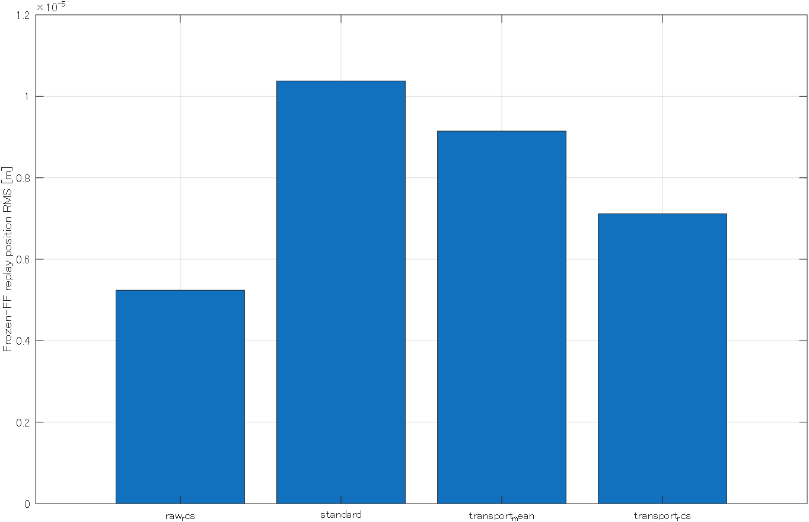
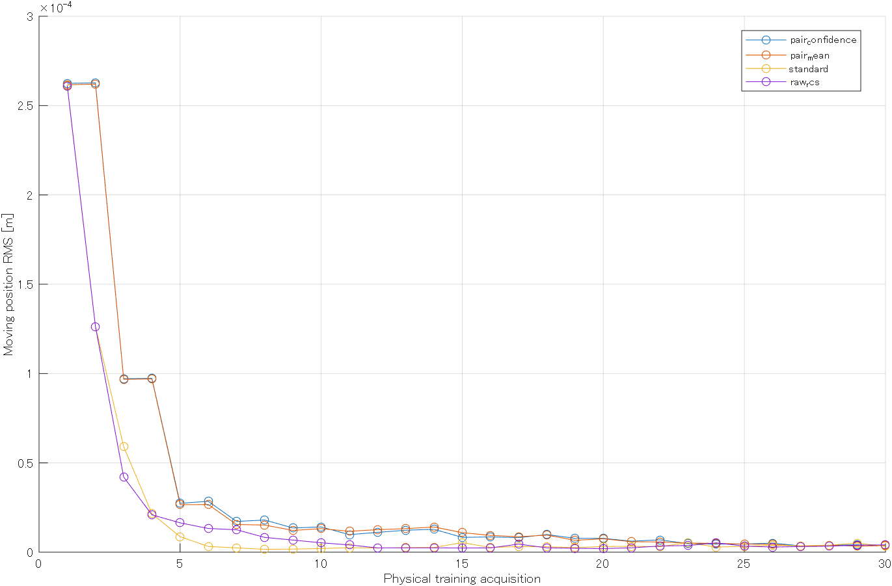

# exp07・exp08の統合と実機確認

PR [#3](https://github.com/MONIN013/LinearProject/pull/3) と
[#4](https://github.com/MONIN013/LinearProject/pull/4) の比較手法を、現行exp04の取得処理へ統合した。
入口は `exp07_RepeatabilityILC/repeatability_experiment.m` と
`exp08_PairedConfidenceILC/paired_confidence_experiment.m`。

## exp07の結果

4手法×15回学習＋5回固定FF評価、計80走行を完了した。
保存済み全3,978,720点のサンプル番号・PLC周期が連続し、fault・I/O異常・電流飽和なし。
全試行の前後無励磁、送信FFとrow7の一致、固定再走行のFF不変を確認した。

| 手法 | 固定5回の平均RMS [µm] | RMSの標準偏差 [µm] | 最大誤差 [µm] | 最大総電流 [A] |
|---|---:|---:|---:|---:|
| 通常ILC | 10.375 | 0.678 | 47.0 | 1.3365 |
| 過渡補正平均 | 9.146 | 0.155 | 41.6 | 1.3248 |
| 過渡補正平均＋ゲート | 7.115 | 0.605 | 27.5 | 1.3246 |
| 未補正履歴ゲート | 5.239 | 0.356 | 18.6 | 1.3146 |

今回の固定評価では未補正履歴ゲートが最小で、過渡補正の優位性は確認できない。
この1ブロックには系列間の時間差・Homingによる開始位置差も含む。

結果: `data/ilc/20260922_000059_526_exp07_repeatability/`。
`block.mat`、`repeatability_metrics.mat/csv`、`audit_results.mat`、`audit_summary.csv`を保存した。

## exp08の結果

4手法×30回学習＋5回固定FF評価、計140走行を完了した。
保存済み全6,962,760点のサンプル番号・PLC周期が連続し、fault・I/O異常・電流飽和なし。
同一ペアのFF一致、最終候補の初回適用、固定5回のFF不変、全試行の前後無励磁を確認した。
通常ILCと未補正履歴ゲートは30回更新、ペア法は同じ30走行から15回更新した。

| 手法（実行順） | 固定5回の全区間平均RMS [µm] | 移動中平均RMS [µm] | 最大誤差 [µm] | 最大総電流 [A] |
|---|---:|---:|---:|---:|
| ペア信頼度付き平均 | 4.773 | 2.676 | 17.8 | 1.3181 |
| ペア平均 | 5.409 | 4.943 | 24.9 | 1.3018 |
| 通常ILC | 6.335 | 6.532 | 28.7 | 1.2970 |
| 未補正履歴ゲート | 8.067 | 8.995 | 40.7 | 1.3001 |

このブロックの固定評価ではペア信頼度付き平均が最小だった。
通常ILCと未補正履歴ゲートでは、固定評価前のHomingを挟んで学習終盤より誤差が増えた。
開始位置・時間変化の影響が残るため、この順位だけで手法の優位性は判断しない。

結果: `data/ilc/20260922_003907_775_exp08_paired_confidence/`。
`manifest.mat`、`block.mat`、`paired_confidence_metrics.mat/csv`、位置・方向別の診断CSV、
`audit_results.mat`、`audit_summary.csv`を保存した。実行ログは `.codex-temp/exp08-20260922/`。
MATLAB終了コード0。終了後は位置54,100,899 count、速度0、全4軸の電流指令0・無励磁、
fault 0、`p_active=0`、`p_servo=0`を確認した。

## 実装と条件

- exp04への追加は単一軌道の初期FFと更新callback。通常ILC・速度スイープ・exp05/06の教師取得は従来の経路を使う。
- TwinCAT・Simulinkの制御構造は変更せず、配備済み共通TcCOM 0.0.0.40を使う。再ビルド・Activateは行っていない。
- 現行neoと同じ4 kHz・Q420 Hz・1.25 m往復・最大0.3 m/s・`a_max=12`（実ピーク9 m/s²）。各系列前に54,100,000 countへHomingする。
- 既存の総電流2 A上限、追従・終端・可動域・欠測・前後無励磁の確認を維持する。FF単独の4 Aガードは追加しない。
- exp07は4手法それぞれ15回学習し、最後に印加したFFで5回再走行する。手法順のseedは7。
- exp08は4手法それぞれ30回学習し、最終計測から作った未印加候補を固定して5回評価する。手法順のseedは8。ペア法は同一FFの2計測ごとに更新する。
- 結果は `data/ilc/` 内の各実験ディレクトリへ集約する。各系列のMATから全計測・軸ログを復元でき、blockには結果への参照を保存する。

各実験は一つの手法順による記述比較。温度・時間変化と手法の効果を分離する反復ブロックは実施していない。

## 検証

MATLAB R2025aで、実際の有限長Qと25 ms端処理を含む `check_exp07` と `check_exp08` が成功した。
標準更新との一致、固定FFの保持、ペアの共通学習率、同一・反対・ゼロ候補を確認した。
既存 `tests/test_ilc_experiment.m` は5件成功。保存タイミングの修正後、入口・速度スイープ契約の2件だけ再確認した。

## 初回の保存失敗

2026-09-21 23:51のexp07初回は、通常ILCの1往復後、進捗MATの置換でWindowsのファイル使用中エラーとなった。
計測の欠落は0。MATLAB終了コード1、終了後は全4軸無励磁・電流指令0・fault 0、位置54,100,029 countを確認した。
同一試行で取得直後と更新後に二度保存していた処理を、更新後の一度へまとめた。
ただし23:54の再実行でも10試行目に同じ置換失敗が起き、保存回数の削減だけでは解消しなかった。
取得10回の欠測は0、停止後の位置54,100,880 count、全4軸無励磁・指令0・fault 0を確認した。

`save_experiment_result` のWindowsでのファイル置換だけに、最大5回・合計1秒の待機を加えた。
保存済み一時MATと旧結果を保ったまま置換を試し、解消しないエラーはそのまま報告する。
計測や実機走行の自動再試行は行わない。50,000点×15試行相当のMATで20回連続上書き・再読込一致を確認した。
さらに.NETで保存先を一時的に排他ロックする回帰テストが成功した。

例外時には取得済み履歴と失敗理由を保存する。失敗記録は次の場所に保持し、完了比較へ混ぜない。

- `data/ilc/20260921_235113_493_exp07_repeatability/`
- `.codex-temp/exp07-exp08-20260921/`
- `data/ilc/20260921_235439_248_exp07_repeatability/`
- `.codex-temp/exp07-exp08-20260921-retry01/`

## 取得済み系列の継続

00:00開始の通常ILCは15回の学習と結果MATの保存まで完了した。
その後、原本退避の引数にcharを渡していたため `fullfile` が失敗した。入口の引数を既存APIどおりstringへ修正した。
保存済みの15回は再取得せず、軌道・制御器・周期・Qを照合して原本退避を完了し、固定FFの再走行から継続した。
途中の実機停止も無励磁・指令0・fault 0を確認した。

過渡補正平均の15回学習後にも結果MATの保存・再読込検証は成功したが、原本13本目の退避で一時的なアクセス失敗が起きた。
原本の属性は通常のArchiveで、停止後には排他読出しができた。退避にも最大5回・合計1秒の待機を加え、
同じ回帰テストに原本の排他ロックと退避後の内容一致を追加した。
統合済み結果MATを再生成せず、未退避の原本だけを退避して固定FF評価から継続した。

全80走行の取得後、レポートの構造体初期化で集計が停止した。
各行をcellへ格納してから表へ変換する形に修正し、保存済みデータから集計・監査を完了した。
同じ初期化を使っていたexp08の集計と結果一覧も、実行前に修正した。

修正後のexp08は、入口スクリプトの実行から140走行・集計・保存結果の照合まで中断なく完了した。
